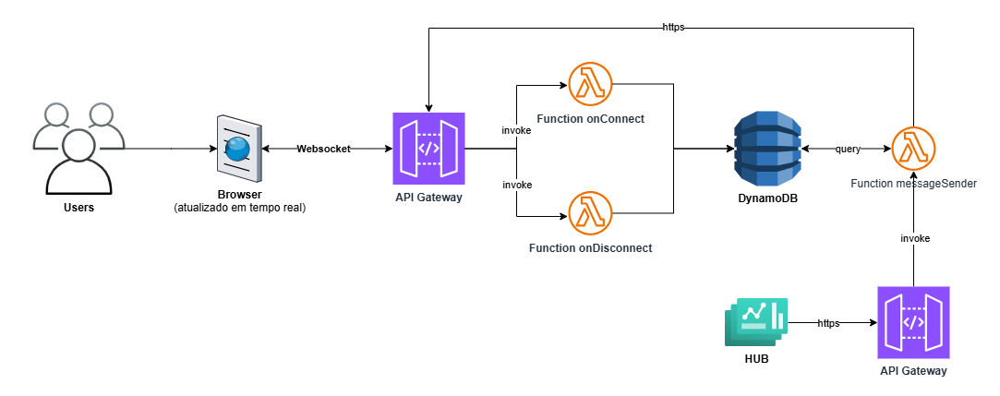

# python-lambda-hub-websocket-auth


Este projeto implementa uma arquitetura de comunicação em tempo real utilizando WebSocket via API Gateway, AWS Lambda e DynamoDB. O serviço permite que sessões conectadas via navegador troquem mensagens em tempo real através de um HUB centralizado.

---

## Sumário

* [Arquitetura da Solução](#arquitetura-da-solução)
* [Tecnologias Utilizadas](#tecnologias-utilizadas)
* [Estrutura do Projeto](#estrutura-do-projeto)
* [Deploy](#deploy)
  * [Pré-requisitos](#pré-requisitos)
  * [Passos de Deploy](#passos-de-deploy)
* [Rotas WebSocket](#rotas-websocket)
* [Testes Locais](#testes-locais)
* [Especificação Funcional](#especificação-funcional)
  * [**Visão Geral**](#visão-geral)
* [Funcionalidades](#funcionalidades)
  * [1. Conexão WebSocket (**_$connect_**)](#1-conexão-websocket-_connect_)
  * [2. Desconexão WebSocket (**_$disconnect_**)](#2-desconexão-websocket-_disconnect_)
  * [3. Envio de Mensagem (**_sendMessage_**)](#3-envio-de-mensagem-_sendmessage_)
* [Autenticação e Segurança](#autenticação-e-segurança)
  * [Exemplo de Geração da Assinatura (Python)](#exemplo-de-geração-da-assinatura-python)
* [Estrutura da Tabela DynamoDB](#estrutura-da-tabela-dynamodb)
* [Tratamento de Erros e Logs](#tratamento-de-erros-e-logs)
* [Fluxo Arquitetural](#fluxo-arquitetural)
* [Monitoramento](#monitoramento)

---

## Arquitetura da Solução

Abaixo está o fluxo completo do serviço WebSocket com API Gateway e AWS Lambda:


---

## Tecnologias Utilizadas

- **AWS Lambda (Python 3.10)**
- **Amazon API Gateway (WebSocket)**
- **Amazon DynamoDB**
- **AWS SAM (Serverless Application Model)**
- **AWS Secrets Manager**

---

## Estrutura do Projeto

    python-lambda-hub-websocket-auth/
    │
    ├── connect/ # Lambda: onConnect
    │ └── on_connect_lambda.py
    │
    ├── disconnect/ # Lambda: onDisconnect
    │ └── on_disconnect_lambda.py
    │
    ├── send-message/ # Lambda: messageSender
    │ └── on_send_message_lambda.py
    │
    ├── template.yaml # Definição AWS SAM (CloudFormation)
    └── events/ # Eventos de teste para invocação local


## Deploy
### Pré-requisitos
AWS SAM CLI

### Passos de Deploy
```bash
aws configure
sam build
sam deploy --guided
```

Durante o deploy, você informará:
* Nome da stack;
* Região AWS;
* Nome da tabela DynamoDB (TABLE_NAME);
* Nome do segredo no Secrets Manager (SIGNING_SECRET_NAME);
* Endpoint WebSocket (opcional).


## Rotas WebSocket

| Rota WebSocket | Função Lambda      | Ação                                                 |
| -------------- | ------------------ |------------------------------------------------------|
| `$connect`     | ConnectFunction    | Valida assinatura e salva conexão na tabela DynamoDB |
| `$disconnect`  | DisconnectFunction | Remove conexão da tabela                             |
| `sendMessage`  | MessageFunction    | Envia mensagens para as conexões                     |


## Testes Locais
Utilizar os eventos de teste disponíveis em events/ com o comando:
```bash
sam local invoke ConnectFunction --event events/connect.json
```

## Especificação Funcional
### **Visão Geral**
O serviço permite a troca de mensagens em tempo real entre usuários conectados a um HUB WebSocket, utilizando AWS Lambda e DynamoDB para persistência e comunicação via API Gateway.

## Funcionalidades
### 1. Conexão WebSocket (**_$connect_**)
- Trigger: Evento de conexão WebSocket.
- Ação: A Lambda ConnectFunction armazena connection_id e session_id no DynamoDB após validar a assinatura.
- Objetivo: Registrar usuários para comunicação futura.

### 2. Desconexão WebSocket (**_$disconnect_**)
- Trigger: Encerramento de conexão.
- Ação: DisconnectFunction remove o connection_id da tabela DynamoDB.
- Objetivo: Limpar conexões inativas.

### 3. Envio de Mensagem (**_sendMessage_**)
- Trigger: Mensagem do cliente contendo lista de sessões.
- Ação:
  - MessageFunction busca todos os connection_id relacionados aos session_id fornecidos.
  - Usa o apigatewaymanagementapi para enviar mensagens em tempo real.
- Objetivo: Disseminar atualizações entre clientes conectados.

## Autenticação e Segurança
O cliente WebSocket deve enviar os seguintes headers obrigatórios:
- X-Session: ID da sessão
- X-Date-Time: Timestamp da requisição (ISO8601)
- X-Signature: Assinatura HMAC calculada com o segredo armazenado no AWS Secrets Manager.

A assinatura é validada no formato:
```bash
assinatura = HMAC(secret, "{session_id}:{date_time}")
```
O sistema valida:
- Presença dos headers obrigatórios;
- Timestamp com tolerância de 5 minutos;
- Assinatura usando **_hmac.compare_digest_**.

### Exemplo de Geração da Assinatura (Python)
```python
import hmac
import hashlib

session_id = "session123"
date_time = "2025-05-26T14:00:00Z"
secret_key = "sua_chave_secreta"

data_to_sign = f"{session_id}:{date_time}".encode('utf-8')
signature = hmac.new(secret_key.encode('utf-8'), data_to_sign, hashlib.sha256).hexdigest()

print(signature)

```


## Estrutura da Tabela DynamoDB

| Atributo      | Tipo |
|---------------|------|
| session_id    | S    |
| connection_id | S    |


## Tratamento de Erros e Logs
- Todas as funções utilizam _try/except_ para tratamento de erros.
- Logs de eventos e falhas são enviados ao AWS CloudWatch.
- Retornos HTTP padronizados:
  - 400 – Headers obrigatórios ausentes.
  - 403 – Timestamp inválido ou assinatura incorreta.
  - 500 – Erro interno inesperado.


## Fluxo Arquitetural
1. O cliente conecta via WebSocket enviando os headers de autenticação.
2. **_ConnectFunction_** valida a assinatura e registra a conexão.
3. **_MessageFunction_** envia mensagens para as conexões relacionadas ao _session_id_.
4. **_DisconnectFunction_** remove a conexão ao desconectar.


## Monitoramento
- Logs completos via AWS CloudWatch.
- Métricas nativas do API Gateway e Lambda disponíveis no AWS Console.

---


